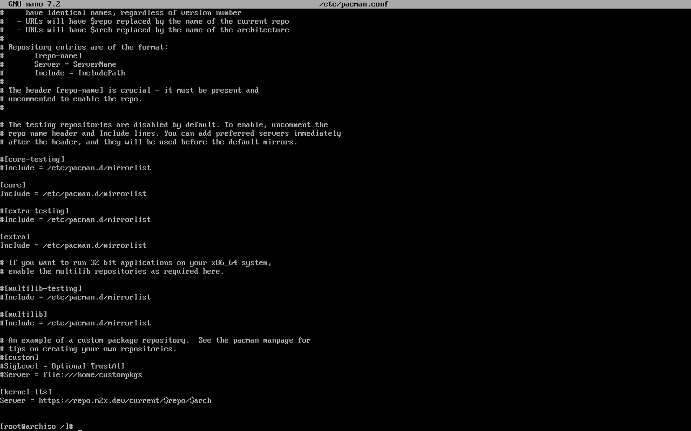

# Sistemas operativos 2

## Wilfred Stewart Perez Solorzano
## 201408419

## Javier Oswaldo Mirón Cifuentes 
## 201602694

## Hector Josue Orozco Salazar 
## 201314296

</br>
</br>


## Practica 2
</br>

s
# Descripcion

Más del 50% de los servidores utilizados para construir los servicios de internet utilizan el sistema operativo Linux. Debido a que es un sistema seguro y de código abierto, las empresas lo utilizan por sus garantías y bajo costo.
Para esta fase es necesario implementar Arch Linux en una máquina virtual, con la versión de kernel 5.4. Considerando las ventajas que ofrece Arch Linux, como su enfoque en la libertad y personalización, el modelo de lanzamiento continuo, el amplio repositorio de software, la documentación extensa y el rendimiento eficiente, creemos que será la elección adecuada para las necesidades específicas del monitor de procesos y memoria.

Para esto, se necesitará realizar los siguientes pasos:
1. Configurar una máquina virtual: Seleccionar una solución de
virtualización adecuada y configurar una máquina virtual con los
recursos necesarios.
2. Descargar la imagen de instalación: Obtener la imagen de instalación
oficial de Arch Linux desde el sitio web oficial.
3. Instalación de Arch Linux: Seguir las instrucciones proporcionadas en la
documentación oficial y la Arch Wiki para realizar la instalación de Arch
Linux en la máquina virtual.
4. Instalación de Kernel 5.4
5. Creación del usuario so2_practica2_<<no_grupo>>
6. Configuración del entorno: Realizar la configuración necesaria después
de la instalación, incluyendo la personalización del entorno de escritorio
o la instalación de los paquetes de software requeridos

</br>

# Monitor de Procesos y Memoria 
Se deberá implementar un servidor web en Golang, creando una API simple para obtener información sobre el CPU, Memoria RAM e información detallada sobre la asignación de memoria de los procesos, haciendo uso de los módulos del Kernel desarrollados en la Practica 1. Queda a discreción del estudiante cuál tecnología utilizar para la interfaz gráfica que deberá ser visible a través del navegador.

## Módulos a implementar

### Módulo de CPU:
Este es el mismo que fue desarrollado en la Practica 1, solamente debe ser implementado en Arch Linux. 
### Módulo de memoria:
Este es el mismo que fue desarrollado en la Practica 1, solamente debe ser implementado en Arch Linux.

# APLICACIÓN WEB
La aplicación web permite visualizar gráficas dinámicas que muestren:
* Uso del CPU.
* Uso de la memoria RAM del servidor.
* La aplicación web permite mostrar la información básica de los procesos que se ejecutan y de sus hijos si tuviesen.

# Dependencias
## FRONTEND
* npx create-react-app frontend
//progress bar
* npm install --save react-circular-progressbar
* npm i axios

---
## Backend GO 

Para go.mod 
-   go mod init main.go
Para go.sum 
-   go tity

---

# Flujo de la aplicacion

Crear los archivos de cpu y ram
```
    make all
```

para cargar los modulos a los procesos de la maquina anfitrion
- sudo insmod cpu_g12.ko
- sudo insmod ram_g12.ko

Ejecutar el backend de go
- go run main.go
<br/>
        <center> ### Recordar que tiene un .env ### </center>

---
# Dependencias maquinas virtuales 

## Modulos
*   sudo apt install make

## gcc
* sudo apt update
* sudo apt install build-essential
* sudo apt-get install manpages-dev
* gcc --version

<br/>
<br/>
<br/>


---
# Instalacion de ArchLinux
---
# Paso 1
- Se crearan las particiones pertinentes para poder instalar el sistema operativo
    - fdisk /dev/sda
En esta crearemos particiones primarias
ingresando los siguientes comandos en orden

```
- n
- p
- n 
- p
```

<br/>
<br/>
<br/>


# Paso 2
Contruir el area trasiego para archlinux con el siguiente comando
```
mkswap /dev/sda1
```

y crearmos el sistema de archivo en formato ext4 con el siguiente comando
```
mkfs.ext4 /dev/sda2
```

<br/>
<br/>
<br/>

# Paso 3
Instalando arch con el siguiente comando
```
pacstrap /mnt base base-devel
```
<br/>

<br/>
<br/><br/>
<br/>

# Paso 4
Se usa fstrap para configurar el sistema operativo
```
genfstra -U /mnt > /mnt/etc/fstrab
arch-chrooot /mnt
```

<br/>

<br/><br/>
<br/>

# Paso 5
Configuramos el reloj, para esto utilizamos la localizacion de Mexico en el area Baja Sur con el siguiente comando
```
ln -sf /usr/share/zonaeinfo/Mexico/BajaSur /etc/localtime
```

<br/>

<br/><br/>
<br/>

# Paso 6
Instalar el kernet 
Para ello debemos editar el archivo de configuracion añadiendo el repositorio para poder ser consultado y descargado para poder instalar el kernel especifico, para esta practica se solicita el kernel 5.4

```
nano /etc/pacman/conf
```

<br/>

<br/>
- Editando el archivo
<br/>

<br/><br/>
<br/>

#  Paso 7
Agregamos la llave, esta llave la podremos obtener en la pagina oficial de arch linux

<br/>

<br/><br/>
<br/>

# Paso 8
Procedemos a firmar el kernel con la misma llave

<br/>

<br/>

<br/><br/>
<br/>
# Paso 9
Instalamos el kernel 5.4 con el siguiente comando
```
pacman -Syu linux-lts54 linux-lts54-headers
```

<br/>

<br/>
<br/>

<br/><br/>
<br/>

# Paso 10
Ahora agregaremos el idioma a utilizar, para ello editamos el archivo de configuracion descomentando el idioma que deseemos, en este caso utilizaremos 2
-   en_US.UTF-8
-   es_MX.UTF-8


Luego generamos los idiomas que descomentamos
```
locale-gen
```
<br/>

<br/><br/>
<br/>

# Paso 11
Editaremos e l host para la conexion de red, para ello creamos un archivo host en el cual editaremos con nuestra ip
```
127.0.0.1   localhost
::          localhost
127.0.1.1   myarch

```
<br/><br/>
<br/>


# Paso 12
Instalamos sudo con el siguiente comando
```
pacman -S sudo
```

<br/>

<br/>

<br/>
<br/>
<br/>

# Paso 13
Crearemos un nuevo usuario, para la practica utilizaremos el nombre de <b>so2_practica2_g12</b>
con el siguiente comando 
```
useradd -m so2_practica2_g12
```

Le asignaremos permisos para poder utilizar el comando sudo con el siguiente comando
```
usermod -aG wheel,audio,video,storage so2_practica2_g12
```
<br/>

<br/><br/>
<br/>

Le asignaremos los permisos editando visudo con nano:
```
EDITOR=nano visudo
```

<br/>

<br/>
<br/>
<br/>

# Paso 14
Activaremos el networkmanager y el adaptador de arch con systemctl
```
systemctl enable gdm.service
```

<br/>

<br/>
<br/>

# Paso 15
Nos saldremos de este paso con el comando exit
```
exit
```
<br/>

<br/>

* Desmontamos la unidad con el siguiente comando
```
unmont /mnt
```
<br/>

<br/>

# Paso 16
Procedemos a apagar la computadora con el siguiente comando
```
shutdown now
```
<br/>


<br/>

<br/>


---
Fin de la instalación
---

# Cambios en los modulos por cambio de version
---
## Version de kernel 5.4
---
## Cambios en el modulo de cpu

* Utilizando version > 5.6
```
<linux/sched.h>
```
```
state
```
```
static struct proc_ops operaciones =
{
    proc_ops.open = al_abrir,
    proc_ops.read = seq_read
};
```


* Utilizando version = 5.4
```
#include <linux/sched/signal.h> 
```
```
_state
```
```
static struct file_operations operaciones =
{
    .open = al_abrir,
    .read = seq_read
};
```


## Cambios en el modulo de memoria

* Utilizando version > 5.6
```
static struct proc_ops operaciones =
{
    proc_ops.open = al_abrir,
    proc_ops.read = seq_read
};
```

* Utilizando version = 5.4
```
static struct file_operations operaciones =
{
    .open = al_abrir,
    .read = seq_read
};
```
